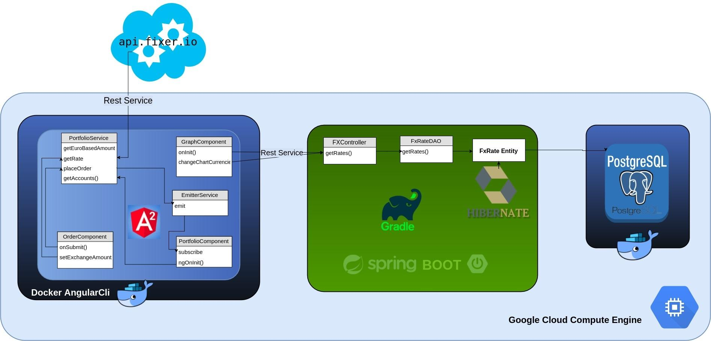

# Simple Spring boot demo application to expose Foreign Exchange Rates Rest Service

http://demo-mikedo-angular.online

# Use Docker container containing PostgreSql DataBase to store historical fx rates

docker run --name some-postgres -e POSTGRES_PASSWORD=mypassword -d -p 5432:5432 postgres

#Use gradle to manage dependencies and build app with Spring boot

    gradle clean build

    gradle bootRun
    
# Go to the application to see index page

    http://localhost:8080

# To get historical rates go to

http://demo-mikedo-angular.online:8080/fxRates?currencyPair=CADEUR

#here are the available currencies pairs
#  USDEUR
#  EURUSD
#  JPYEUR
#  GBPEUR
#  AUDGBP
#  CADEUR
#  CHFEUR